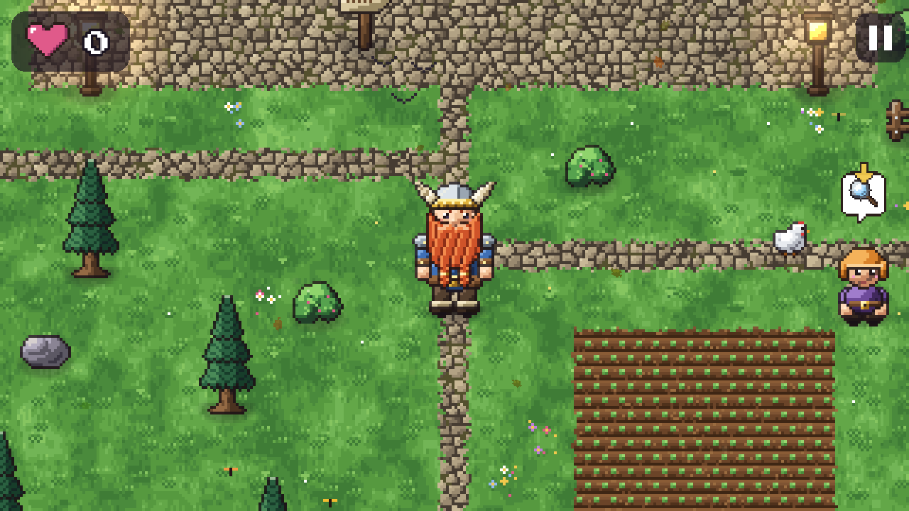
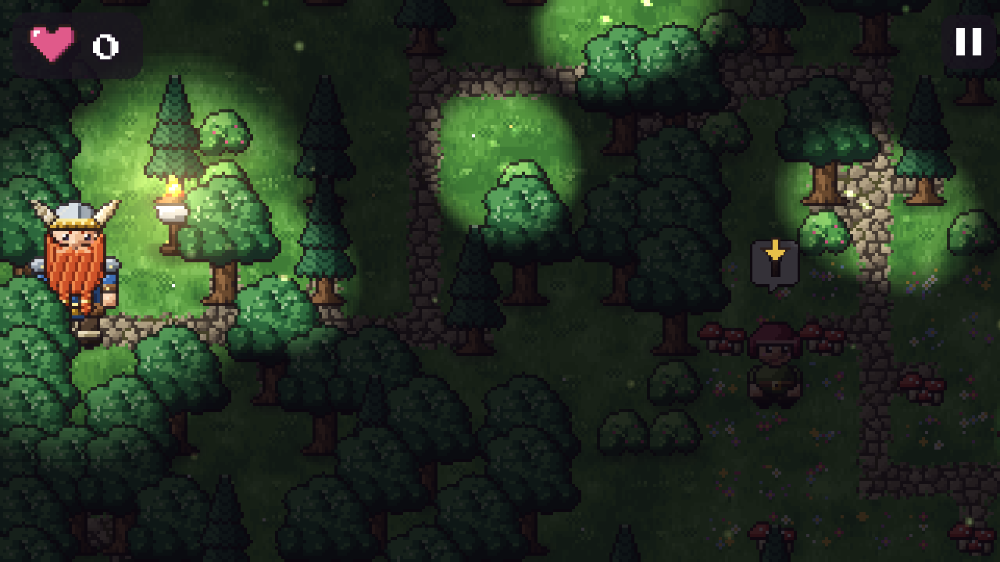
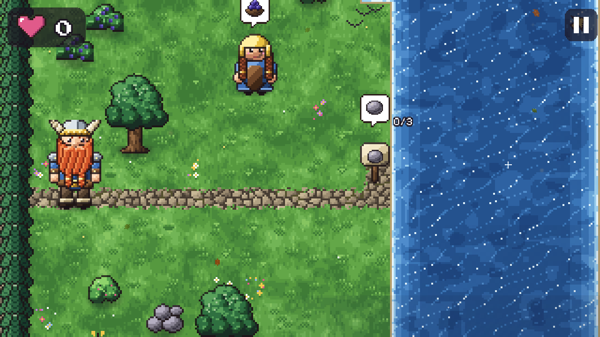
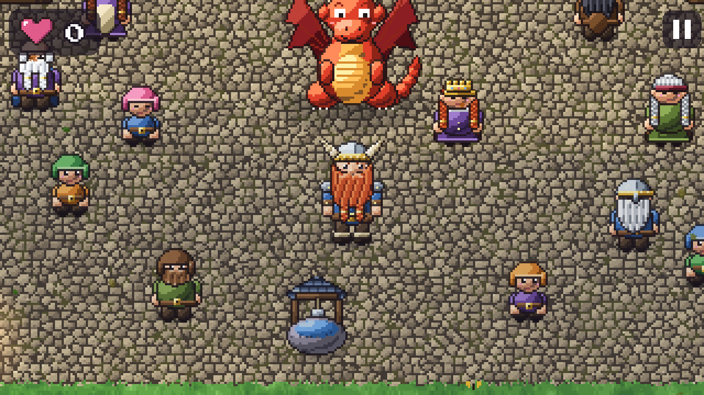
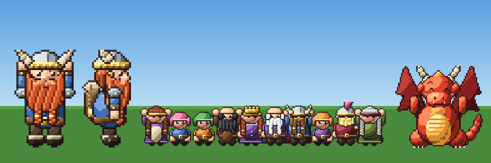
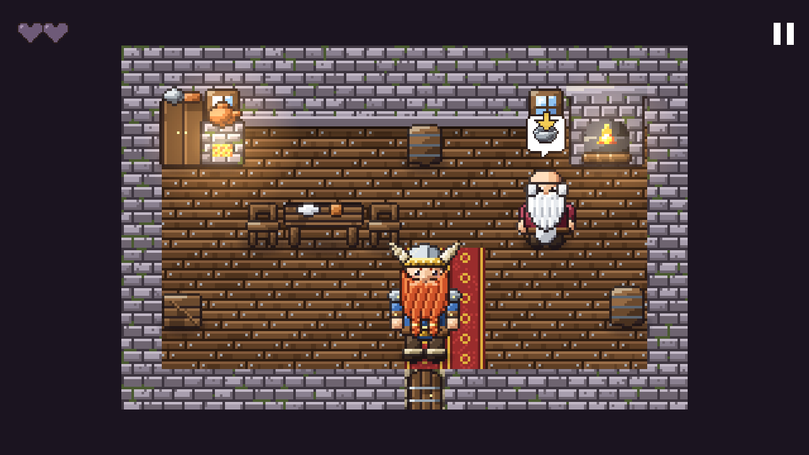
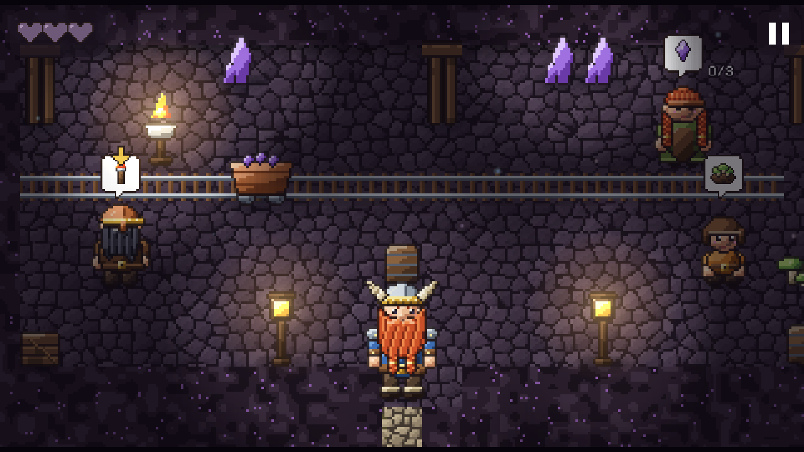
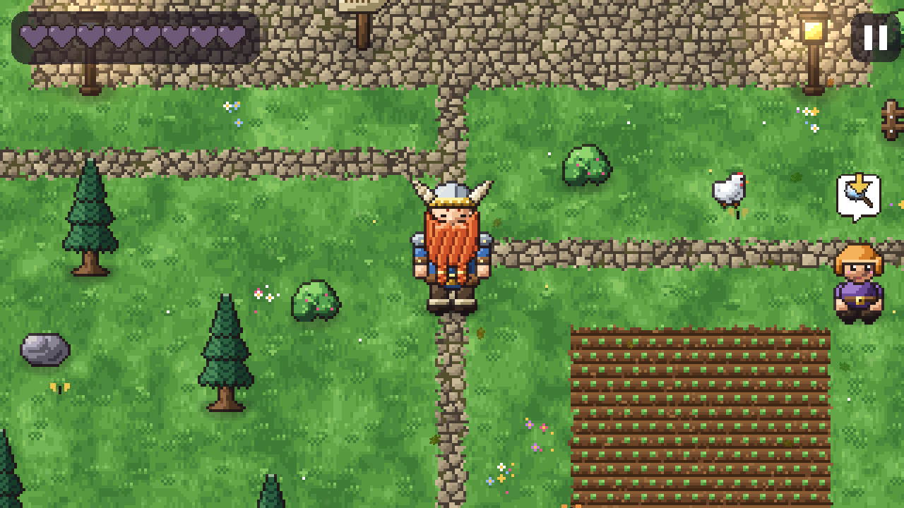
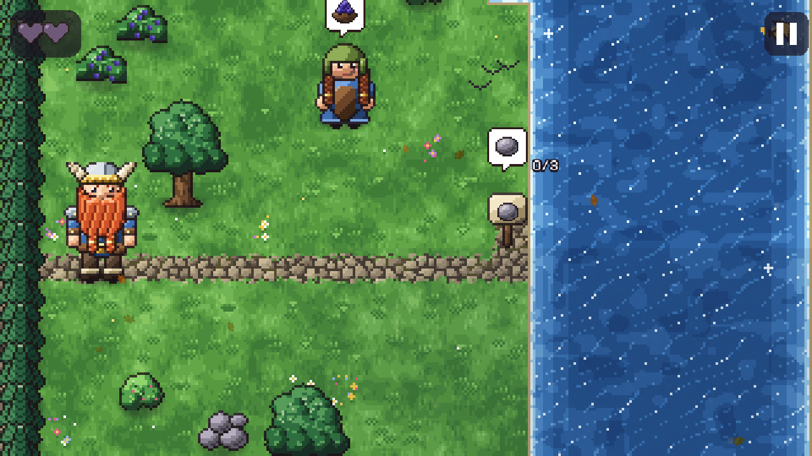
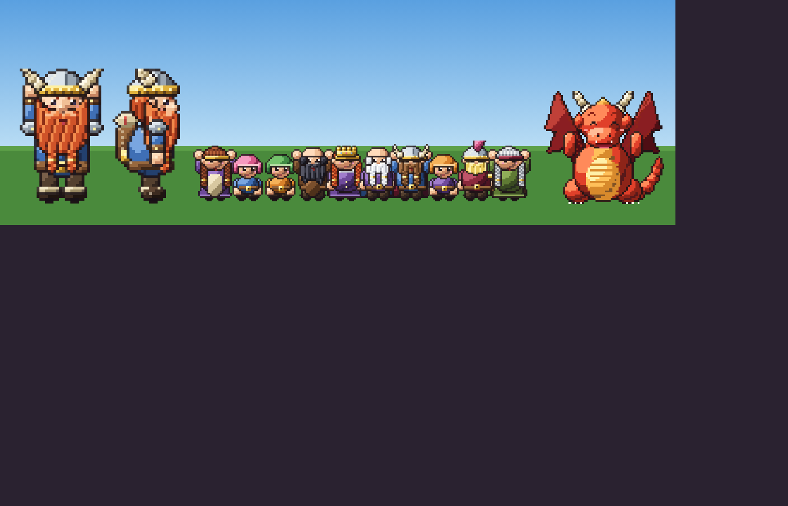

# 🕰️ So ist das Spiel gewachsen

Vom ersten spielbaren Dorf bis heute: Hier sieht man, wie «Der Grosse Zwerg» Schritt für Schritt entstanden ist.
Alle Bilder sind echte Bildschirmfotos aus dem jeweiligen Stand. Die alten Bilder liegen in
[`docs/verlauf/`](verlauf/), die aktuellen in [`docs/bilder/`](bilder/).

---

## 1 · Der erste Prototyp — 26.09.2026

Davids Gute-Nacht-Geschichte wird zum Spiel: Kapitel 1 «Die Zwergenfeste» ist spielbar.
Einfache Klötzchen-Grafik, glatte Flächen, Wasser in einem Blau, eine normale Schrift.
Aber schon dabei: der Grosse Zwerg mit Hörnerhelm und rotem Bart, der gelbe Pfeil und das Helfen-Herz.

| Titelbild | Im Dorf |
|---|---|
|  |  |

---

## 2 · Der SNES-Look — 26.09.2026, am Abend

Alles neu gezeichnet, wie auf dem Super Nintendo: Figuren aus Teilen mit Umriss und Schattierung,
Boden mit weichen Übergängen und Kopfsteinpflaster, Laternen mit Lichtschein, Hühner, Schmetterlinge.
Dazu drei Spielstände und grosse Splash-Bilder für schöne Momente.

| Titelbild | Im Dorf |
|---|---|
|  |  |

---

## 3 · Die ganze Geschichte — 27.09.2026

Alle fünf Kapitel sind da: die Königin, die grosse Reise über See, Tal und durch den dunklen Wald,
Glutherz in der Drachenhöhle, der Flug zum Schloss und das grosse Fest. Pixel-Schrift, Menü mit
Einstellungen und eine Steuerung für das Handy (hochkant mit einer Hand oder quer).

| Im Dorf | Der dunkle Wald |
|---|---|
|  |  |
| **Glutherz** | **Das Fest** |
|  |  |

**29.09.2026 · Kapitel 6 «Die Ehrengarde»:** Das Spiel hört nicht mehr auf. Der Grosse Zwerg wohnt mit
Glutherz in einem eigenen Zuhause, holt Aufträge am Missionsbrett und zieht sich an der Kleiderkiste um.
Neue Aufgaben: Hühner einfangen, Versteckis, Blumen nach Farben sortieren, Wegweiser mit Witzen.

---

## 4 · Der 90er-Look — 01.10.2026

Mehr Details, wie bei späten SNES- und Game-Boy-Advance-Spielen: 5 statt 3 Farbtöne pro Farbe,
farbige Umrisse, Bärte mit Strähnen, Helme mit Glanz, Bäume aus vielen Blätter-Büscheln, Gras mit Klee,
Pflastersteine mit Licht und Schatten, tieferes Wasser, Dachziegel und Mauersteine, schwebende Leuchtsporen im Wald.
Alles weiterhin im Code gemalt.

| Im Dorf | Der dunkle Wald |
|---|---|
|  |  |
| **Am See** | **Das Fest** |
|  |  |

**03.10.2026 · Der Drache heisst jetzt Füürio.** Auf Wunsch der Familie trägt Glutherz einen neuen Namen.
Dazu: Der Xbox-Controller funktioniert jetzt überall, auch bei «Wer spielt?», und den Namen eines neuen
Spiels ändert man über ein gut sichtbares Kästchen.

---

## 5 · Häuser, Mine und Herzen — 04.10.2026 (heute)

Nach dem ersten Familientest: Drei Häuser in der Zwergenfeste kann man jetzt betreten, eingerichtet mit Bett,
Herd, Kamin, Schrank, Wiege und Schaukelstuhl. Dort gibt es Aufgaben (Suppe kochen, Teddy suchen, Tee), und Bauer
Torvi draussen braucht seine Jacke von drinnen. Die **Zwergenmine** ist ein eigener Ort mit Schienen, Loren und
leuchtenden Kristallen. Statt einer Zahl zeigen **leere Herzen**, wie viel es an einem Ort zu tun gibt; jede Hilfe
füllt eins. Dazu: Das Seil sieht wie ein Seil aus, Füürios Augen und Kopf sind ganz zu sehen, und der Spielstand
bleibt bei neuen Versionen erhalten.

| Opa Balins Küche | Die Zwergenmine |
|---|---|
|  |  |
| **Im Dorf (Herzen oben links)** | **Am See** |
|  |  |

---

## 🔭 Wohin es geht

- **Grafik:** Füürio und das Pony im neuen Look, Wasserlilien und Schilf am See, weiche Schatten von
  Bäumen und Häusern (siehe [Grafik-Roadmap](GRAFIK-ROADMAP.md)).
- **Neue Missionen** ([Issue #20](https://github.com/GSB-Deleven/Game-Der_Grosse_Zwerg/issues/20)):
  Mühle nach dem Sturm reparieren, ein Troll mit Zahnweh, Laternen gegen den Nebel im Wald,
  ein Geburtstagskuchen für die Königin, das Winterfest.
- **Zuhause:** das Steinhaus als Belohnung, Sattel und Halstuch für Füürio.
- **Stimmen:** echte Stimmen statt Plappern ([Issue #11](https://github.com/GSB-Deleven/Game-Der_Grosse_Zwerg/issues/11)).

---

So wird der Verlauf weitergeführt: Wenn sich der Look sichtbar ändert, wandern die alten README-Bilder aus
`docs/bilder/` nach `docs/verlauf/<datum>-<name>/`, neue Bilder kommen nach `docs/bilder/`, und hier kommt eine
neue Stufe dazu. Das Gruppenbild entsteht mit `galerie.html?nur=gruppenbild`.
